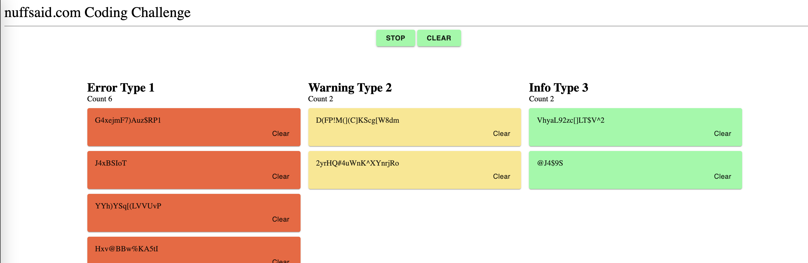

## React Coding Challenge

This code challenge tests your skills in react.js (using Typescript), testing and modular design.
The purpose of the application is to correctly render a stream of messages coming from an api. Different messages will be coded different colors and require slightly different rendering. The rules are described in detail below.

This challenge already includes an API response. It is not required or expected for you to make any changes to this interaction.

The 3 priorities that we provide you are:
  * 0 = error
  * 1 = warning
  * 2 = info

### Acceptance Criteria

1. Messages should be rendered in a table-like structure. The newest messages should appear at the top of their respective columns.
2. Provide test coverage of the components. 
3. Ensure UI Matches the image

### Note

1. The example design below.

2. The messages should be color coded depending on the priority of the message. The appropriate color per priority is:

   * error: #F56236
   * warning: #FCE788
   * info: #88FCA3
3. Each time a message with the priority level of error is received, a snackbar containing the error message should also appear at the top right of the application. The error should disappear in 2 seconds, when another error message takes its place, or when the user clears it via the provided button located in the error message.
4. A user should be able to clear all messages at any point.
5. A user should be able to clear a specific message in a specific column
6. A user should be able to start and stop incoming messages. By default the messages should be running and displaying on the grid. The start/stop button should update depending on the state of the feed.
7. A user should see a count of specific messages in each column
8. Use material-ui components and styled-component styles
9. Write meaninful and useful unit tests. `jest` is already included in the project
10. Use functional components
11. Improve code structure. Your implementation should be more like how you do it for any production grade application development
12. Define Typescript types where necessary
13. Please submit your code either via Github or Gitlab
14. Use React context API and hooks to showcase your understanding of these React features
15. Pay attention to performance of your page rendering
16. "nunffsaid.com Coding Challenge" is part of the design. Make sure that you dont miss that header

***Applicants are provided this challenge with no expectation on deadline. Please take the time you need to complete the challenge to the best of your ability.***
